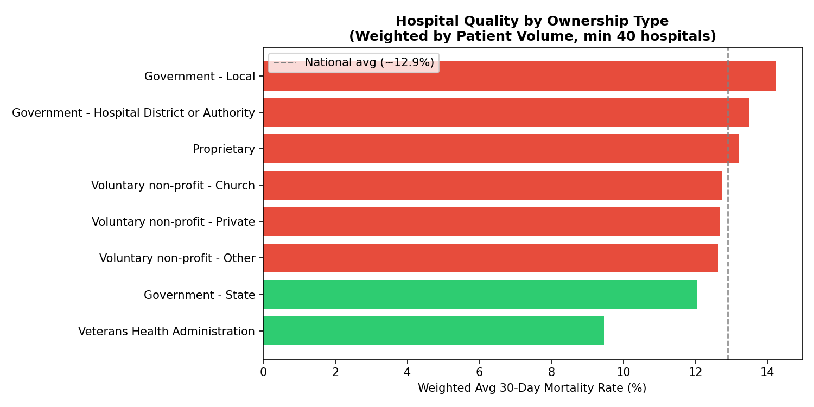
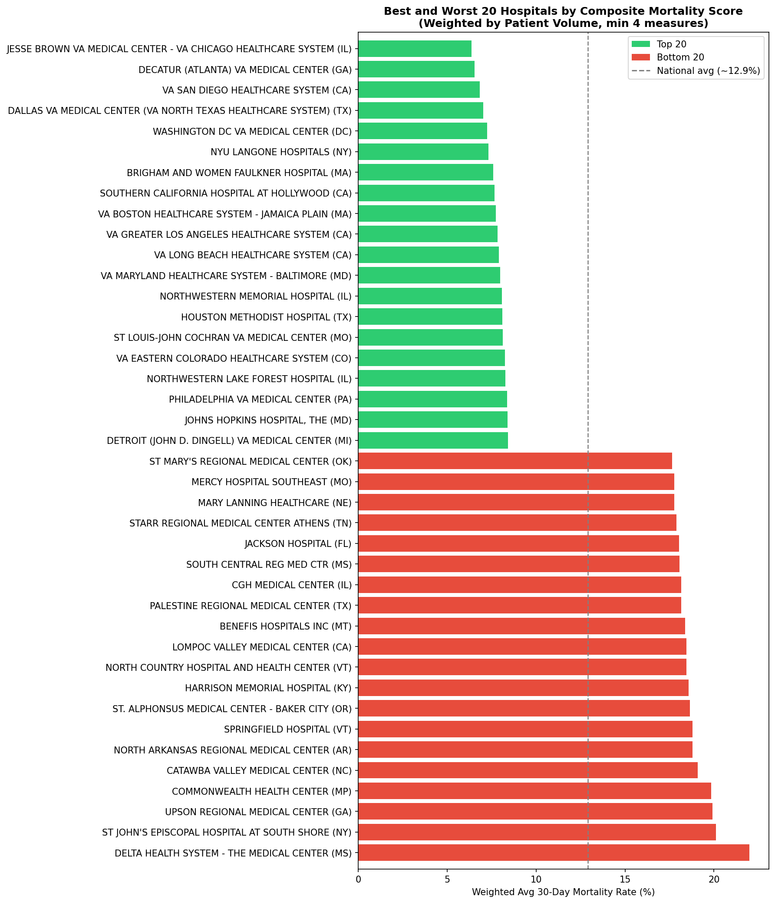
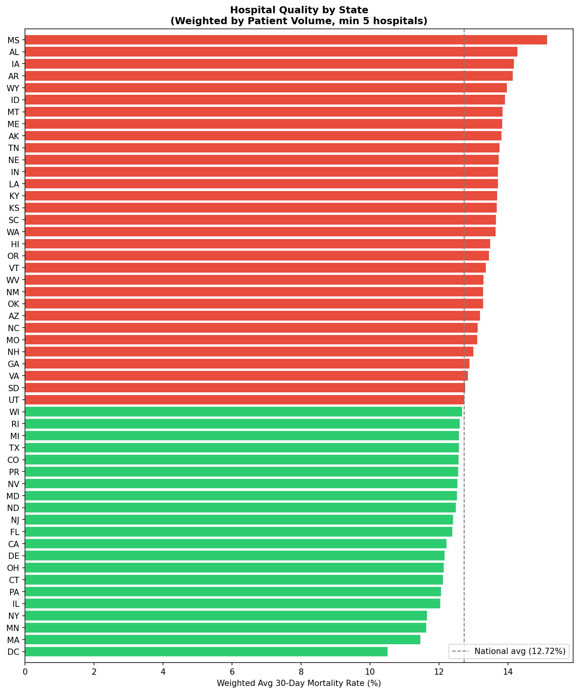
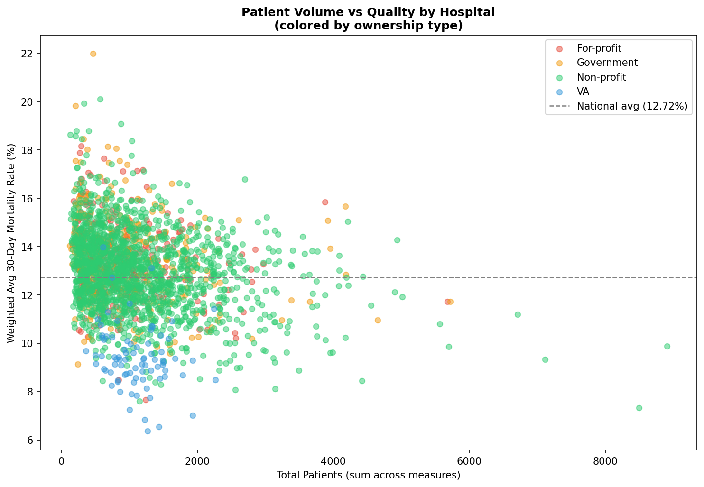
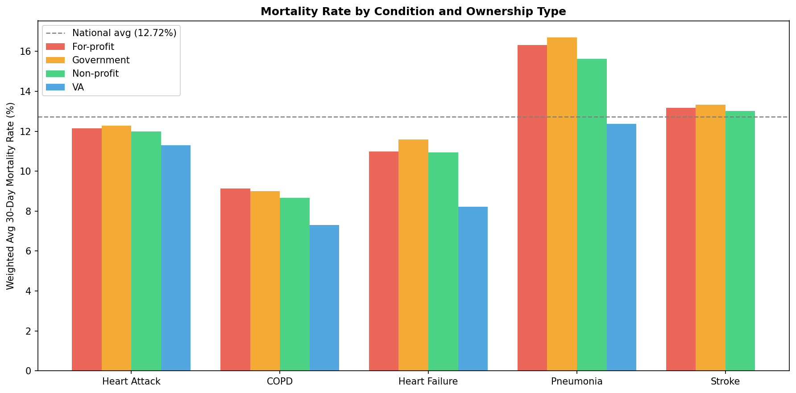

# Provider Quality Analysis — CMS Hospital Data

Analysis of U.S. hospital quality using public CMS (Centers for Medicare & Medicaid Services) data.
Designed to mirror the type of provider evaluation work done at companies like Garner Health.

---

## Motivation

Healthcare quality varies dramatically across hospitals, states, and ownership types —
but that variation is rarely visible to patients or employers. This project uses
real CMS data to surface those differences using SQL-first analysis in DuckDB.

---

## Data Sources

Downloaded manually from the [CMS Provider Data Catalog](https://data.cms.gov/provider-data):

| File | Description | Rows |
|---|---|---|
| `Hospital_General_Information.csv` | Hospital metadata: location, type, ownership | 5,432 |
| `Complications_and_Deaths-Hospital.csv` | Quality measures by hospital and condition | 95,840 |

> Data files are excluded from this repo (see `.gitignore`). Download instructions below.

---

## Setup

```bash
git clone https://github.com/KelyNorel/provider-quality-sql.git
cd provider-quality-sql
pyenv virtualenv 3.11 provider-quality-sql
pyenv local provider-quality-sql
pip install -r requirements.txt
```

### Download the data manually

1. Go to https://data.cms.gov/provider-data/dataset/xubh-q36u → Download CSV → save as `data/raw/hospitals.csv`
2. Go to https://data.cms.gov/provider-data/dataset/ynj2-r877 → Download CSV → save as `data/raw/complications.csv`

---

## Analysis

### Notebook 1 — `01_explore.ipynb`: SQL Analysis

#### Finding 1 — Heart Attack Mortality Outliers

Of 4,792 hospitals with data on 30-day heart attack mortality (`MORT_30_AMI`),
only **13 hospitals (0.3%)** perform statistically worse than the national rate.

The `Score` column represents the 30-day mortality rate — the percentage of
patients who die within 30 days of a heart attack admission. The national
weighted average is 12.72%. These 13 hospitals range from 14.4% to 17.1%,
meaning up to **4 additional deaths per 100 patients** compared to the national benchmark.

Note: 37.5% of hospitals had too few cases to evaluate, and 21.8% had no data
available — a critical consideration for any provider recommendation model.

#### Finding 2 — Composite Quality Ranking

To rank hospitals across multiple conditions, we built a composite score
averaging 5 mortality measures: heart attack, heart failure, pneumonia,
stroke, and COPD — restricted to hospitals reporting at least 4 of the 5,
weighted by patient volume.

Top performers: NYU Langone (6.96%), VA San Diego (7.55%), Brigham and Women's
Faulkner (8.28%), Cedars-Sinai (8.32%), Mayo Clinic Rochester (8.84%), and
Johns Hopkins (8.84%). Top-ranked hospitals show roughly **4-6 fewer deaths
per 100 patients** than the national benchmark.

#### Finding 3 — State Rankings (Weighted by Volume)

Aggregating across 5 mortality measures weighted by patient volume,
**Massachusetts ranks #1** (weighted avg 11.46%), followed by Minnesota (11.63%)
and New York (11.65%).

Weighting by patient volume meaningfully changes rankings — using a simple
average, NJ ranked #3; with weighted average it drops to #10, because its
high-volume hospitals perform worse than its small ones.

#### Finding 4 — Ownership Type vs Quality

**Veterans Health Administration hospitals rank #1** with a weighted average
mortality rate of 9.46% — nearly 3 points below the national average —
outperforming all private, nonprofit, and other government systems.

For-profit hospitals (13.21%) perform above the national average. Groups
with fewer than 40 hospitals (Physician-owned, Tribal) excluded from comparison.

---

### Notebook 2 — `02_visualize.ipynb`: Visualizations

#### Hospital Quality by Ownership Type

VA hospitals and Government-State facilities are the only ownership types
performing below the national weighted average (12.72%). For-profit hospitals
consistently underperform.



---

#### Best and Worst 20 Hospitals

The gap between the best and worst hospitals is striking: top performers cluster
around **6–9% weighted mortality**, while the worst reach **17–22%** — more than
triple the rate of the top performers. VA hospitals dominate the top 20. The worst
performers are concentrated in rural areas and southern states, with Delta Health
System (MS) ranking last at 22.3%.



---

#### Hospital Quality by State

A clear geographic divide: Mississippi ranks worst (15.1%), while DC ranks best
(10.6%). The South and rural Midwest consistently underperform; the Northeast
and upper Midwest lead. Geographic location is a strong predictor of care quality.



---

#### Patient Volume vs Quality

High-volume hospitals tend to have lower mortality rates. The worst performers
(top-left) are almost exclusively small hospitals with fewer than 500 patients.
VA hospitals (blue) cluster consistently below the national average regardless
of volume. For-profit hospitals (red) show the widest variance.



---

#### Mortality Rate by Condition and Ownership Type

The VA advantage holds consistently across all reported conditions — COPD (7.31%),
Heart Failure (8.22%), Heart Attack (11.29%). Pneumonia is the highest-mortality
condition across all ownership types (12.3–16.7%), while COPD has the lowest rates.

Note: VA hospitals show no reportable stroke data (`MORT_30_STK`) — 132 VA
facilities appear in the dataset but are marked "Not Available" by CMS, likely
due to low case volume per facility or separate VA reporting requirements.



---

### Notebook 3 — `03_provider_recommendation.ipynb`: Provider Recommendation Engine

Simulates a provider recommendation system: given a state and a condition, 
returns the top 5 hospitals ranked by weighted mortality rate, with context 
on statistical reliability and magnitude of difference.

Three cases demonstrated:

**Case 1 — New York, Heart Attack (MORT_30_AMI)**
NYU Langone ranks #1 at 6.7% mortality — 43% better than #2 (Montefiore, 9.6%).
Rank alone is misleading; the gap between #1 and #2 is far larger than between #2 and #5.

**Case 2 — Texas, Pneumonia (MORT_30_PN)**
Houston Methodist leads at 8.9%. All top 5 are certified "Better Than the National Rate."
The Houston Methodist system appears 3 times — a signal of system-wide quality standards.

**Case 3 — Mississippi, Heart Failure (MORT_30_HF)**
Despite MS being the worst state overall, its top hospitals show competitive rates (9.3–10.6%).
None are certified "Better Than the National Rate" due to low patient volumes.
Top 5 in MS = top 9.3% of 54 eligible hospitals vs top 2.4% in TX — context matters.

---

## SQL Concepts Covered

- `JOIN` across multiple tables
- CTEs (`WITH ... AS`)
- Window functions (`RANK() OVER()`, `SUM() OVER()`)
- Weighted averages (`SUM(score * denominator) / SUM(denominator)`)
- `HAVING` vs `WHERE`
- `CAST` for type conversion
- `CASE WHEN` for categorical recoding
- `UNION ALL` for combining result sets
- Filtering and aggregation on real clinical data

---

## Stack

- **DuckDB** — SQL engine (Snowflake-compatible syntax)
- **Python / pandas** — data loading and display
- **matplotlib** — visualizations
- **Jupyter** — notebook environment

---

## Project Structure

```
provider-quality-sql/
├── data/
│   ├── raw/          # CMS source files (not tracked in git)
│   └── processed/    # DuckDB database file (not tracked in git)
├── figures/          # Generated visualizations
│   ├── ownership_quality.png
│   ├── top_bottom_hospitals.png
│   ├── state_ranking.png
│   ├── volume_vs_quality.png
│   └── mortality_by_condition.png
├── notebooks/
│   ├── 01_explore.ipynb         # SQL analysis and findings
│   ├── 02_visualize.ipynb       # Charts and visualizations
│   └── 03_provider_recommendation.ipynb  # Provider recommendation engine
├── src/
│   └── queries.sql         # Final SQL queries (clean, no Python)
├── .gitignore
├── requirements.txt
└── README.md
```

---

## Author

Raquel (Kely) Norel, PhD — [LinkedIn](https://www.linkedin.com/in/raquel-norel) · [Google Scholar](https://scholar.google.com/citations?user=_7vMqI4AAAAJ&hl=en)
